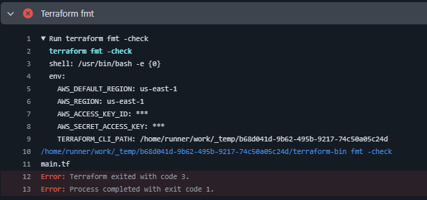

# Terraform-CI-Workflow
Basic CI workflow

Github branch protection rule:   
   
](image-1.png)   

Debug:   
Error found:   

   
You're getting this error because terraform fmt -check found formatting issues in your Terraform files (specifically, main.tf).
The exit code 3 is expected behavior when -check detects files that are not properly formatted.
   
✅ What it means   
Your Terraform file(s) have formatting issues. The CI pipeline is intentionally failing because you’ve enabled terraform fmt -check, which checks if files are formatted and fails if they’re not.
   
🔥 How to fix it   
On your local machine, run:
   
terraform fmt - check   
terraform fmt     
echo $?
This will auto-format your .tf files correctly. Then, commit and push the changes:
   
git add .   
git commit -m "Fix: Terraform format issues"   
git push origin <your-branch>  

add branch
change to dev branch